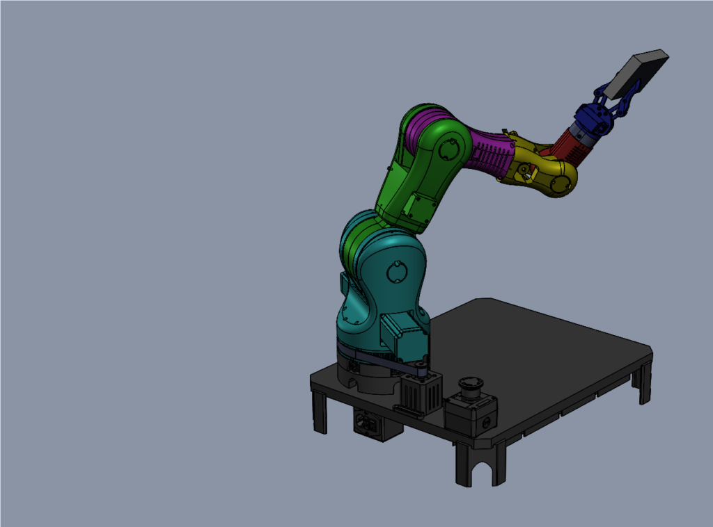
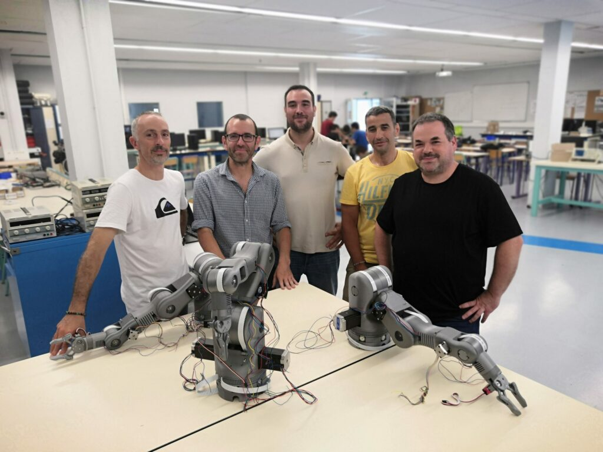

# Bras robotique 6 axes imprimé en 3D de l'Ecole des Mines d'Alès

[{.center}](https://www.bcn3d.com/ecole-des-mines-dales-3d-printed-6-axis-robot-arm/){target=_blank}

Nous sommes deux professeurs qui enseignons les Sciences du Génie Industriel depuis environ 20 ans. Après quelques années en région parisienne, nous avons atterri à l'académie de Montpellier, au lycée Albert Einstein de Bagnols-sur-Cèze. Depuis octobre 2017, nous enseignons également la Robotique à l' [Ecole des Mines d'Alès](https://www.imt-mines-ales.fr/){target=_blank} aux futurs ingénieurs en Mécatronique.

## Se concentrer sur nos étudiants
A notre arrivée à l'Ecole des Mines d'Alès, nous avons été dotés de deux bras robotiques industriels 6 axes de type UR5 (Universal Robots) pour assurer nos travaux pratiques en Robotique. 

Après l'émerveillement d'un si gros investissement (de l'ordre de 40.000 €), on s'est aperçu assez vite que nos élèves ingénieurs s'ennuyaient ! Après quelques heures d'utilisation, les étudiants se sont rendus compte qu'ils ne pouvaient pas modifier le contrôle de ces bras robots industriels et ainsi tester les résultats de leurs calculs.

La principale réflexion qui nous passait par la tête était : « Comment positionner la pratique au cœur de l'enseignement de la robotique alors que le coût d'acquisition d'un bras industriel est de plusieurs dizaines de milliers d'euros ? ». Et donc, en 2018, nous avons alors pris la décision de concevoir notre propre bras articulé et sa commande. Parallèlement à un certain nombre de projets innovants pour maintenir l'engagement des étudiants, nous nous sommes donné pour mission de maintenir l'engagement de nos étudiants. 

Au départ, nous avions envisagé d'acheter des bras robots pédagogiques fabriquées par la société française Nyrio, mais nous n'étions pas sûrs de pouvoir modifier la commande. De plus, les dimensions et l'aspect "jouet" nous rebutent. Avant tout, nous souhaitions avoir un contrôle total sur les parties mécaniques et de contrôle de notre bras afin qu'elles puissent évoluer en fonction des besoins des utilisateurs : nos élèves. Par la suite, nous nous sommes appuyés sur [le bras open source MOVEO de BCN3D](https://www.bcn3d.com/bcn3d-moveo-the-future-of-learning-robotic-arm/){target=_blank}  pour développer notre bras.

## Se lancer dans l'impression 3D
La création du bras a été rendue possible grâce à l'impression 3D. D'abord avec l'utilisation du logiciel de CAO, [SolidWorks](https://www.solidworks.com/){target=_blank}, qui nous a semblé une évidence ! Cela nous a permis de rendre le bras très modulable et adaptable au besoin et de le faire évoluer en fonction des contraintes techniques et des retours des utilisateurs.

{.center}

Pour permettre à nos élèves de travailler de manière pratique et concrète sur un bras robotisé, il fallait multiplier ces bras et accepter le risque de casse. L'impression 3D était la solution évidente !

L'impression 3D (FDM) avec les imprimantes de notre atelier nous a permis de réaliser facilement et rapidement un prototype et de valider la faisabilité de ce projet. 

Nous souhaitons que la fabrication du bras soit accessible à tous. L'utilisation du PLA limite fortement le coût de la matière (moins de 25 €/kg) et le prix d'achat de l'imprimante 3D (à partir de 200 €).

Aussi, le coût de fabrication réduit de ce bras permet l'achat de plusieurs bras pour un faible coût et permet à nos élèves d'avoir facilement à leur disposition un bras articulé 6 axes et sa commande.

Les pièces, y compris celles imprimées en 3D, sont ensuite assemblées et motorisées par les étudiants eux-mêmes.

## Fonctionnement du bras
L'utilisation de [Scilab](https://www.scilab.org/){target=_blank} pour contrôler les six articulations de notre bras permet à chaque utilisateur d'avoir accès au contrôle du bras dans un environnement informatique simple et entièrement programmable. Scilab, l'équivalent libre et open source de Matlab, est distribué sous licence GNU GPL.

<figure>
<iframe width="560" height="315" src="https://www.youtube-nocookie.com/embed/0IuvasmCI30" title="YouTube video player" frameborder="0" allow="accelerometer; autoplay; clipboard-write; encrypted-media; gyroscope; picture-in-picture" allowfullscreen></iframe>
</figure>

Afin d'aller vers un développement plus durable, nous avons choisi de sourcer notre filament d'impression 3D auprès d'un fabricant français [Francofil](https://francofil.fr/){target=_blank}.

## De nos jours
En 2022, le proviseur du Lycée A. Einstein, M. Feutry, nous a confié la réalisation de la première série de quatre bras pour les mettre à disposition des différentes sections pédagogiques du lycée technique et professionnel.

Après l'achat de la première série de bras par l'Ecole des Mines d'Alès, chaque élève ingénieur peut travailler de manière pratique sur un bras robotisé. Les futurs ingénieurs peuvent ainsi tester leurs calculs dans la pratique et voir immédiatement l'effet de leurs modifications sur le comportement du bras.

Le bras a transformé la façon dont les étudiants travaillent et maintient à la fois les étudiants et les enseignants sur leurs orteils. En apprenant au rythme des élèves, les enseignants doivent eux aussi se tenir au courant des dernières innovations en matière de robotique. 

Nous avons établi des partenariats avec d'autres écoles, pour fournir le bras robotisé à un prix coûtant. En échange, les lycées testent le bras avec leurs élèves et nous font part de leurs retours.

Notre objectif à long terme est de proposer ce bras comme un outil open-source afin que chaque étudiant et enseignant puisse construire son propre bras.  

{.center}

## Ce à quoi nous pouvons nous attendre
Dès le début de ce projet mêlant mécatronique et impression 3D, nous étions certains que ce projet pouvait remettre la pratique au cœur de l'enseignement de la robotique, quel que soit l'âge ou le niveau de nos élèves. 

Nous recherchons donc des partenaires pour contribuer à l'évolution de cette branche, développer des activités autour d'elle et réaliser son potentiel à travers des centres de formation et des entreprises de niveau industriel. Nous sommes convaincus que son accessibilité, son faible coût d'acquisition, son utilisation modulaire de l'impression 3D et son système de contrôle ouvert et configurable joueront en notre faveur. De plus, il est modulaire grâce à l'utilisation de l'impression 3D et d'un système de contrôle ouvert et configurable. Nous voulons rendre la robotique accessible à tous !

Lien pour lire l'article original en Anglais : [BCN3D » Changemakers » Ecole des Mines d’Alès’ 3D printed 6-axis robot arm](https://www.bcn3d.com/ecole-des-mines-dales-3d-printed-6-axis-robot-arm/)

<!-- Ceci est la future page d'accueil du site présentant le projet de développement d'un bras articulé 6 axes imprimé en 3D et de sa commande...

Ce site est généré automatiquement par GitHub Action avec le framework MkDocs et le thème Material. -->

